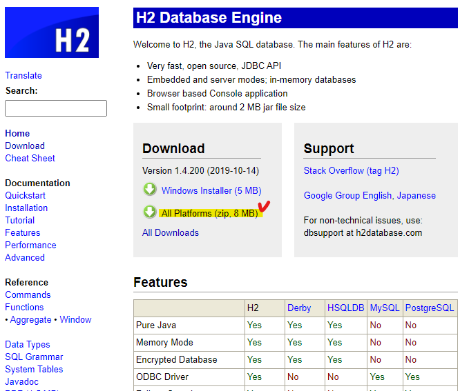
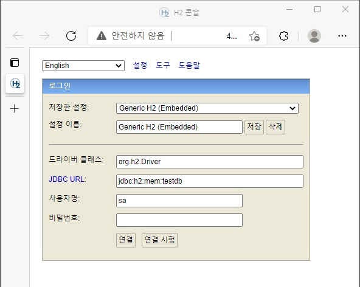
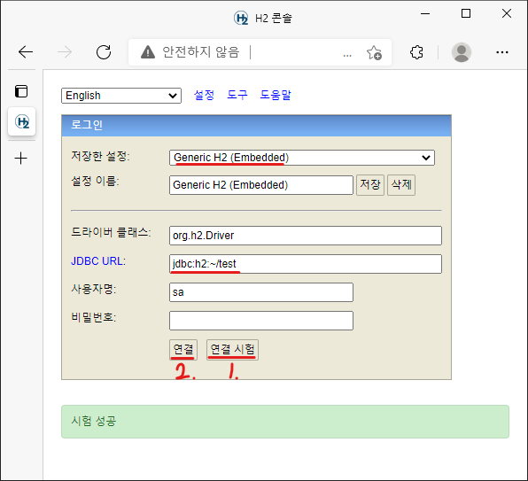
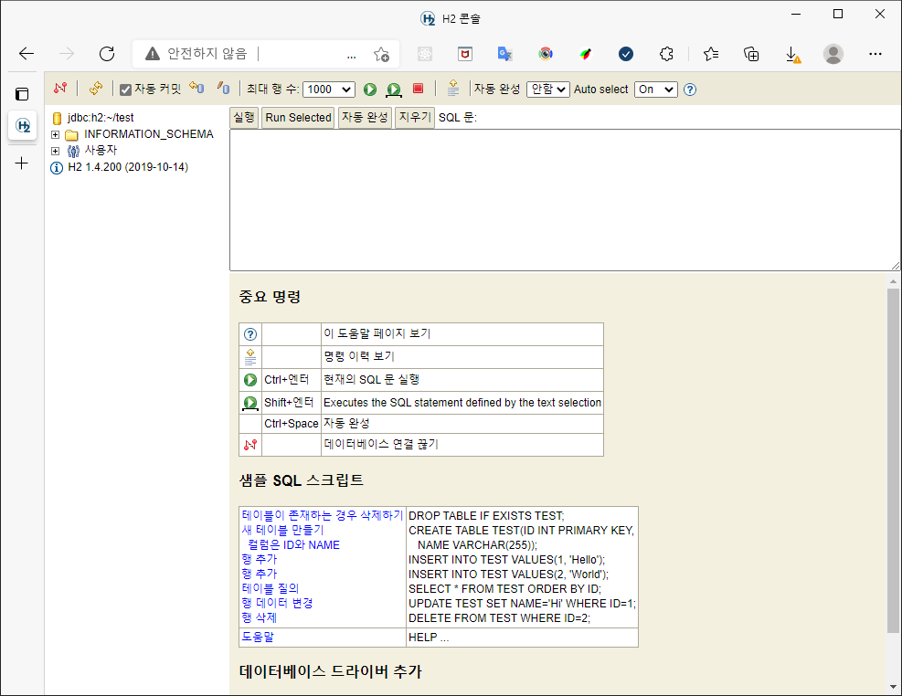
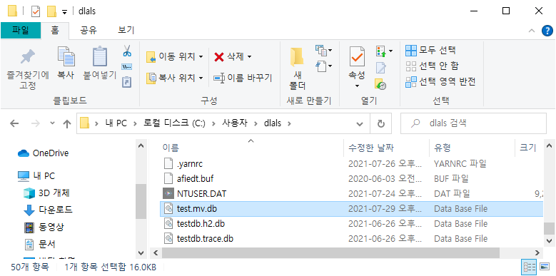

## 목차

- [H2 Database](#h2-database)
- [H2 Database 설치](#h2-database-설치)
    - [1. 다운로드](#1-다운로드)
    - [2. 실행](#2-실행)
    - [3. H2 데이터베이스 생성](#3-h2-데이터베이스-생성)
    - [생성된 데이터베이스 파일 위치](#생성된-데이터베이스-파일-위치)
- [JPA Gradle Project 생성](#jpa-gradle-project-생성)

# H2 Database

자바 기반의 경량화된 데이터베이스

H2 데이터베이스는 설치가 필요 없고 용량이 매우 가벼우며 웹용 콘솔(쿼리툴)을  
제공하여 개발용 로컬 DB로 사용하기 좋은 데이터베이스이다.

- 스프링 부트가 지원하는 인메모리 관계형 데이터베이스이다.
- 인메모리로 띄우면 애플리케이션을 재시작할 때마다 초기화된다.
- 별도의 설치가 필요 없다.
- 로컬 환경, 테스트 환경에서 많이 사용된다.

# H2 Database 설치

### 1. 다운로드

H2 설치 링크 : https://www.h2database.com/html/main.html

All Platforms 압축 파일을 다운받고 원하는 경로에 압축을 풀어준다.

### 2. 실행

압축을 풀면 `h2`폴더 하위에 있는 `bin` 폴더로 들어가서 `h2.bat` 또는 `h2w.bat`을 실행한다. Unix 계열은 `h2.sh`로 실행시키면 된다.

- `~/h2/bin/h2.bat`
- `~/h2/bin/h2w.bat`
- `~/h2/bin/h2.sh`

실행하면 아래와 같이 기본 브라우저에서 H2콘솔창이 열린다.

열린 화면은 H2 콘솔 로그인 화면으로 자동으로 열리지 않는다면 하단의 아이콘을 클릭하거나  
[http://localhost:8082](#2-실행) 또는 [http://127.0.0.1:8082](#2-실행) 브라우저 URL로 접근해서 열어준다.  
즉, H2 콘솔은 기본적으로 본인 ip와 8082 포트로 접근된다는 것을 알 수 있다.

### 3. H2 데이터베이스 생성

처음 열린 H2 콘솔 로그인 화면에서 바로 연결하려고 하면 오류가 발생한다.  
당연한 얘기지만 데이터베이스를 설정하지 않았기 때문에 발생하는 오류다.

아래와 같이 값을 입력 후 '연결 시험' 버튼을 통해서 연결이 가능한지 테스트 해본다.

- 저장한 설정: Generic H2 (Embedded)
- 설정 이름: Generic H2 (Embedded)
- 드라이버 클래스: org.h2.Driver
- JDBC URL: jdbc:h2:~/test
- 사용자명: sa
- 비밀번호: (없음)

연결이 정상적으로 완료 된다면 아래와 같이 H2 콘솔창이 열린다.

### 생성된 데이터베이스 파일 위치

그렇다면 이렇게 정상적으로 생성된 데이터베이스는 어디에 저장되어 있을까?

위의 이미지처럼 사용자 경로로 들어가서 확인해보면 방금 생성한 `test.mv.db` 라고  
데이터베이스 파일이 생성된 것을 확인해볼 수 있다.  
(아래의 다른 디비 파일들은 예전에 내가 생성해놓은 것)

# JPA Gradle Project 생성

사용할 데이터베이스 생성이 끝났으니 이제 JPA 프로그래밍 Java Gradle 프로젝트를 하나 생성해보자.

첫 실행 오류 : 해결방안  
https://yjh5369.tistory.com/entry/intellij-%EC%8B%A4%ED%96%89-%EC%8B%9C-finished-with-non-zero-exit-value-1-%EC%98%A4%EB%A5%98

