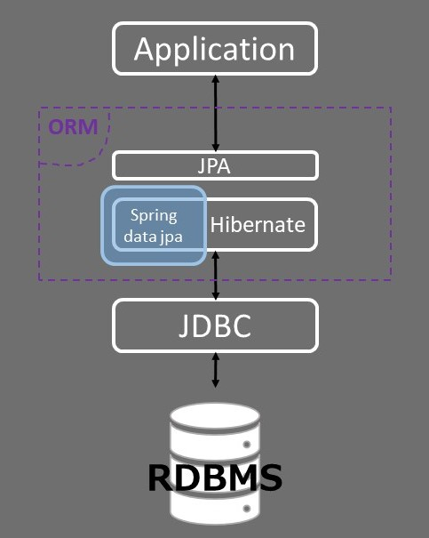

## 목차

- [Spring Data JPA](#spring-data-jpa)
  - [JPA 구조도](#jpa-구조도)
  - [JPA 필수 도구 Lombok](#jpa-필수-도구-lombok)
  - [H2 Database setting](#h2-database-setting)
- [Basic JpaRepository](#basic-jparepository)
  - [CRUD](#crud)
    - [find](#find)
    - [save](#save)
    - [delete](#delete)
  - [QBE QBM](#qbe-qbm)
- [Query Methods](#query-methods)
    - [Spring data jpa tables](#spring-data-jpa-tables)
  - [Methods](#methods)
    - [Kinds of find/select](#kinds-of-findselect)
    - [FirstN TopN](#firstn-topn)
    - [And Or](#and-or)
    - [After Before](#after-before)
    - [Than](#than)
    - [Between](#between)
    - [IsNotNull](#isnotnull)
    - [IsNotEmpty](#isnotempty)
    - [Like](#like)
    - [In](#in)
    - [OrderBy](#orderby)
    - [Pageable](#pageable)
- [Entity](#entity)
    - [`@Entity`](#entity-1)
    - [`@Id`](#id)
    - [`@GeneratedValue`](#generatedvalue)
    - [`@Column`](#column)
    - [`@Table`](#table)
    - [`@Enumerated`](#enumerated)
    - [`@Transient`](#transient)
- [Entity Listeners](#entity-listeners)
    - [Spring Bean 으로 Entity Listener 정의](#spring-bean-으로-entity-listener-정의)
    - [AuditingEntityListener.class](#auditingentitylistenerclass)
    - [응용](#응용)
- [관계 Relational](#관계-relational)
  - [1대1 관계](#1대1-관계)
  - [1대N 관계](#1대n-관계)
  - [N대1 관계](#n대1-관계)

# Spring Data JPA

## JPA 구조도



## JPA 필수 도구 Lombok

- [domain: User](./src/main/java/com/example/jpa/bookmanager/domain/User.java)
- [Test Code](./src/test/java/com/example/jpa/bookmanager/domain/UserTest.java)

## H2 Database setting

- build.gradle

```gradle
dependencies {
  ...
  runtimeOnly 'com.h2database:h2'
  ...
}
```

- src/main/resources/application.yml

```yml
spring:
  h2:
    console:
      enabled: true # h2 console을 사용하는지 여부 설정
  jpa:
    defer-datasource-initialization: true # data.sql을 시스템이 올라온 후 사용할지 여부 설정
    show-sql: true  # jpa 쿼리를 볼 것인지 여부 설정
    properties:
      hibernate:
        format_sql: true  # jpa 쿼리를 정렬된 상태로 볼 수 있는 설정
```

# Basic JpaRepository

- src/main/java/.../UserRepository.java

```java
public interface UserRepository extends JpaRepository<User, Long> {}
```

## CRUD

- 참고: [src/test/.../UserRepository.java](src/test/java/com/example/jpa/bookmanager/repository/UserRepositoryTest.java)

### find

DML의 SELECT와 같은 조회 기능을 하기 위한 메소드 네이밍

- `findAll()`
  - 전체 조회
  - `findAll(Sort sort)`
    - 정렬 조회 (ORDER BY와 동일한 기능)
  - `findAll(Pageable pageable)`
    - Paging 기능
    - `Page<T>`를 리턴
- `findAllById(Iterable<ID> ids)`
  - 복수의 Id를 대상으로 조회 ex) WHERE id IN (?,?,?,...)
- `findById(ID id)`
  - 하나의 Id를 대상으로 조회 ex) WHERE id = ?
- `getById(ID id)`
  - getOne() 메소드와 같은 기능 (@Deprecated -> getOne())

### save

DML의 INSERT, UPDATE와 같은 삽입과 수정 기능을 하기 위한 메소드 네이밍

- `save(S entity)` : 단수/한개의 객체 저장 및 수정
- `saveAll(Iterable<S> entities)` : 복수, 다수의 객체 리스트 저장

### delete

DML의 DELETE와 같은 삭제 기능을 하기 위한 메소드 네이밍

- `delete(T entity)`
  - 매개변수가 null이면 안됨
  - delete를 하기 전에 해당 자료가 존재하는지 여부를 위한 select 쿼리가 돌아감
  - `deleteById(ID id)`
- `deleteAll()`
  - delete 쿼리가 연속적으로 실행됨
  - `deleteAll(Iterable<? extends T> entities)`
- `deleteAllByIdInBatch(Iterable<ID> ids)`
  - delete 쿼리가 하나만 실행되며 or 연산자를 사용하여 삭제 쿼리가 작성됨
  - select 쿼리로 자료존재 여부 확인 안함
  - `deleteAllInBatch(Iterable<T> entities)`
  - `deleteAllInBatch()`
    - 파라미터를 전달하지 않을시 where 조건문 없이 delete from [table-name] 쿼리가 작성됨.
    - 전체 데이터가 삭제되므로 주의해야함.

## QBE QBM

- QBE = Query By example
- QBM = Query By Matcher
- matcher는 어떻게 보면 만능같아 보이지만, 약간의 제약이 있다. 예) String 자료형만 가능
- 실제로 matcher는 생각보다 많이 쓰이지 않는다고 한다.

의도 : `WHERE email LIKE '%.com'`

```java
ExampleMatcher matcher = ExampleMatcher.matching()
        .withIgnorePaths("name")    // 무시할 필드명
        .withMatcher("email", endsWith());  // 매칭할(조건절) 필드명
Example<User> example = Example.of(new User("mi", ".com"), matcher);
userRepository.findAll(example).forEach(System.out::println);
```

의도 : `WHERE email LIKE '%gmail%'`

```java
ExampleMatcher matcher = ExampleMatcher.matching()
      .withIgnorePaths("name")
        .withMatcher("email", contains());
Example<User> example = Example.of(new User("", "gmail"), matcher);
userRepository.findAll(example).forEach(System.out::println);
```
의도 : `WHERE email LIKE 'email%'`

```java
User user = new User();
user.setEmail("min");
ExampleMatcher matcher = ExampleMatcher.matching().withMatcher("email", startsWith());
Example<User> example = Example.of(user, matcher);
userRepository.findAll(example).forEach(System.out::println);
```

의도: `WHERE email = 'minseo@gmail.com' AND name = 'minseo'`

```java
Example<User> example = Example.of(new User("minseo", "minseo@gmail.com"));
userRepository.findAll(example).forEach(System.out::println);
```

# Query Methods

### Spring data jpa tables

- [Supported Keywords Indside Method Names](../images/table3_supported_keywords_inside_method_names.png)
- [Query Subject Keywords](../images/table8_query_subject_keywords.png)
- [Query Predicate Modifier Keywords](../images/table10_query_predicate_modifier_keywords.png)
- [Query Return Types](../images/table11_query_return_types.png)

## Methods

> 가독성을 위해 매개변수 생략  
> 참고: [src/test/.../UserRepository.java](src/test/java/com/example/jpa/bookmanager/repository/UserRepositoryTest.java)

### Kinds of find/select

SELECT 기능을 뜻하는 메소드 네이밍은 find 뿐만이 아니라 몇가지 더 존재한다.

- **find**ByEmail
- **get**ByEmail
- **read**ByEmail
- **query**ByEmail
- **search**ByEmail
- **stream**ByEmail
- **findUser**ByEmail
- **findSomething**ByEmail

### FirstN TopN

위에서부터 N행의 결과 조회

- find**First1**ByName
- find**Top2**ByName
- find**Last1**ByName (X) 
  - 인식하지 않는 키워드 작성시 -> 오류 또는 무시됨

### And Or

다수의 AND/OR 조건절

    find...By...And...And...And...

- findByEmail**And**Name
- findByEmail**Or**Name

### After Before

비교 연산자 사용

- findById**After**
- findById**Before**

### Than

After/Before는 equal(=)을 포함한 비교 연산자가 적용되지 않는다.  
하지만 than 구문은 GreaterThanEqual(>=) 방식으로 작성 가능하다.  
즉, 가독성은 After, Before가 더 좋겠지만 Than 구문이 더 범용성이 넓다고 볼 수 있다.

- findByCreatedAt**GreaterThan**
- findById**GreaterThanEqual**
- findById**LessThanEqual**

### Between

- findByCreatedAt**Between**

### IsNotNull 

`WHERE id IS NOT NULL` 과 같은 구문을 작성함

- findById**IsNotNull**()

### IsNotEmpty

자바 문자열 not empty는 일반적으로 null과 빈문자열("")의 여부를 확인한다.  
하지만 해당 NotEmpty 구문은 Collection 타입의 NotEmpty를 의미한다.  
relational에서 사용하게 되지만, 잘 사용되지 않는다고 한다.

- findByAddress**IsNotEmpty**()
  - Address : User 엔터티와 관계가 있다고 가정

### Like

- findByName**StartingWith**
- findByName**EndingWith**
- findByName**Contains**
- findByName**Like**
  - ex) `findByNameLike("%ns%")`

### In

**WHERE name IN (?, ?, ?)** 과 같은 IN 연산자 작성

- findByName**In**

### OrderBy

메소드 네이밍 방식 정렬

- findTop1ByName**OrderBy**Id**Desc**
- findTopByName**OrderBy**Id**Desc**

파라미터 방식 정렬 (매개변수로 **Sort** 클래스를 받음)

      List<User> findFirstByName(String name, Sort sort);

- 예시

```java
import org.springframework.data.domain.Sort;
import org.springframework.data.domain.Sort.Order;

userRepository.findFirstByName("John", Sort.by(Order.desc("id"), Order.asc("email")));
```

### Pageable

페이징 기능

      Page<User> findByName(String name, Pageable pageable);

- 예시, 페이징과 정렬 동시 적용 가능

```java
import org.springframework.data.domain.PageRequest;
import org.springframework.data.domain.Sort;
import org.springframework.data.domain.Sort.Order;

userRepository.findByName(
        "John",
        PageRequest.of(0, 1, Sort.by(Order.desc("id")))
).getContent()
```

# Entity

객체와 테이블을 매핑하기 위해 꼭 필요한 어노테이션.  
DTO 클래스에 `@Entity` 어노테이션을 통해 해당 클래스는 엔터티 객체임을 정의할 수 있다.  
해당 어노테이션이 선언된 객체들을 JPA에서 관리한다.

### `@Entity`

JPA프로그래밍을 하기 위한 엔터티 어노테이션으로 해당 어노테이션이 선언된 클래스는 자바 엔터티 객체임을 선언하게 된다. 그렇기 때문에 엔터티의 고유성을 위해 `@Id` 어노테이션이 선언된 변수 작성이 요구된다.

### `@Id`

엔터티 PK 설정

```java
@Id
private Long id;
```

### `@GeneratedValue`

자동 카운트 설정 어노테이션, 주로 PK 값들을 위해 작성된다. 해당 어노테이션을 작성하면 SEQUENCE가 자동 적용된다. 

주요 속성:
- `strategy = GenerationType` : 전략 설정
  - Oracle, MySQL, PostgreSQL... 등 디비별 Sequence 작성법이 다르기 때문에 이 옵션을 사용한다.
  - `GenerationType.TABLE`
    - 키 생성용 테이블 사용, 모든 DB에서 사용
    - `@TableGenerator` 필요
  - `GenerationType.SEQUENCE`
    - 데이터베이스 시퀀스 오브젝트 사용
    - ORACLE
    - `@SequenceGenerator` 필요
  - `GenerationType.IDENTITY`
    - 데이터베이스에 위임
    - MYSQL
  - `GenerationType.AUTO`
    - 방언에 따라 IDENTITY, SEQUENCE, TABLE 중 하나로 자동 지정
    - default

```java
@Id
@GeneratedValue(strategy = GenerationType.IDENTITY)
private Long id;
```

### `@Column`

컬럼과 필드 매핑

- `name` : 필드와 매핑할 테이블 컬럼 이름 (default: 객체의 필드 이름)
- `insertable` / `updatable` : 등록, 변경 가능 여부
- `nullable` : null 값 허용 여부, false 설정시 해당 컬럼에 NOT NULL 제약 조건 생성
- `length` : 문자 길이 제약조건, String 타입에만 사용됨

```java
@Column(updatable = false)
private LocalDateTime createdAt;
```

### `@Table`

엔티티와 매핑할 테이블 지정한다.

주요 속성:
- `name = "<table-name>"` : 매핑할 테이블 이름
- `indexes = {@Index(columnList = "<column-name>")}` : 인덱스 매핑
- `uniqueContraints = {@UniqueConstraint(columnNames = {"<column-name>"})}` : UNIQUE 제약 조건 생성

```java
@Entity // 자바객체 선언 어노테이션
@Table(name = "user",
  indexes = {@Index(columnList = "name")},
  uniqueConstraints = {
    @UniqueConstraint(columnNames = {"email"})
  }
)
public class User{
  ...
}
```

### `@Enumerated`

자바 Enum 타입을 매핑할 때 사용되는 어노테이션

주요 속성:
- `value` : 값 설정, default = `EnumType.ORDINAL`
  - `EnumType.ORDINAL` : Enum 순서를 DB에 저장
  - `EnumType.STRING` : Enum 이름을 DB에 저장

```java
@Enumerated(value = EnumType.STRING)
private Gender gender;
```

### `@Transient`

영속성 처리에서 제외하는 어노테이션, DB데이터 반영X, 해당객체와 생명주기가 동일  
즉, 필드 매핑을 사용하지 않는 변수에 사용하는 어노테이션이다.

- 데이터 저장, 조회 안됨
- 주로 메모리상에서만 임시로 어떤 값을 보관하고자 할 때 사용한다.

```
@Transient
private String testData;
```

# Entity Listeners

Entity Listeners를 통해서 CRUD시 후처리를 할 수 있다.

- `@PrePersist` : 삽입 전
- `@PostPersist` : 삽입 후
- `@PreUpdate` : 변경 전
- `@PostUpdate` : 변경 후
- `@PreRemove` : 삭제 전
- `@PostRemove` : 삭제 후
- `@PostLoad` : 조회가 일어난 직 후

### Spring Bean 으로 Entity Listener 정의

Entity Listener로 등록할 스프링 빈을 정의한다.

```java
@Component
public class MyEntityListener {
    @PreUpdate
    public void postUpdate(Object o) {
      // 업데이트 후 실행할 로직
    }
    ...
}
```

`@EntityListeners` 어노테이션으로 만든 빈을 엔터티 리스너로 등록한다.

```java
@EntityListeners(value = MyEntityListener.class)
public class User {
  ...
}
```

### AuditingEntityListener.class

스프링 데이터에서 기본으로 지원하는 기본 Entity Listener 빈이다. 해당 빈으로 간단하게 엔터티 리스너를 등록할 수 있다.

```java
import org.springframework.data.jpa.domain.support.AuditingEntityListener;

@EntityListeners(value = AuditingEntityListener.class)
public class User {
  @CreatedDate
  private LocalDateTime createdAt;
  @LastModifiedDate
  private LocalDateTime updatedAt;
  ...
}
```

### 응용

데이터 상태를 파악하기 위해 보통 테이블에 생성일(createAt)과 변경일(updatedAt) 컬럼을 추가한다. 그래서 자바 객체 매핑시 해당 컬럼 필드가 중복적으로 작성되는 문제를 피하기 위해 클래스를 따로 정의할 수 있다.

```java
import lombok.AllArgsConstructor;
import lombok.Data;
import lombok.NoArgsConstructor;
import org.springframework.data.annotation.CreatedDate;
import org.springframework.data.annotation.LastModifiedDate;
import org.springframework.data.jpa.domain.support.AuditingEntityListener;

@Data
@NoArgsConstructor
@AllArgsConstructor
@MappedSuperclass // 해당 클래스의 필드를 상속받는 Entity의 필드로 포함시켜 주겠다는 의미
@EntityListeners(value = AuditingEntityListener.class)
public class BaseEntity {
    @CreatedDate
    private LocalDateTime createdAt;
    @LastModifiedDate
    private LocalDateTime updatedAt;
}
```

그리고 엔터티에 상속 시킨다.

```java
@Data
@NoArgsConstructor
@AllArgsConstructor
@Entity
@ToString(callSuper = true) // 부모 클래스를 포함한 toString()
@EqualsAndHashCode(callSuper = true) // 부모 클래스를 포함한 equals(), hashCode()
public class Book extends BaseEntity {
  ...
}
```

# 관계 Relational

RDMS의 테이블들은 연관관계가 설정되어있기 때문에 JPA는 relational 매핑 기능을 제공한다.

## 1대1 관계

1대1 관계를 매핑할때는 `@OneToOne` 어노테이션을 사용한다.

`@OneToOne`
- 해당 어노테이션 작성시 외래키로 설정될 컬럼/필드가 자동으로 생성된다.
- 즉, 외래키 필드를 작성하지 않고 언터티 객체를 필드로 구성한다.
- 기본적으로 `LEFT OUTER JOIN` 으로 조인한다.

주요 속성:
- `optional`
  - null 허용 여부
  - 허용시 외래키에 NOT_NULL 조건 추가
  - 허용시 조인할때 `INNER JOIN` 으로 조인한다.
- `mappedBy`
  - 테이블 생성시 외래키 컬럼이 생성되지 않는다.
  - 즉, 이 속성은 해당 테이블이 연관키를 갖지 않게 하겠다는 것이다.
  - 주의할 점
    - 아무 조건 없이 두 엔터티가 양방향으로 `mappedBy` 속성이 설정되었다면 순환참조 오류인 `StackOverflowError` 예외가 `toString()` 메소드로 인해 발생한다.
    - 때문에 보통의 경우는 `mappedBy` 속성을 한 엔터티에서만 설정하여 단방향으로 처리한다.
    - 특별한 경우에는 `toString` 제외 어노테이션을 추가한다. : `@ToString.Exclude`

```java
// 양방향인 경우의 예시

@Data
@NoArgsConstructor
@AllArgsConstructor
@Entity
@Table
public class BookReviewInfo {
  ...
  @OneToOne(optional = false)
  private Book book;
}

@Data
@NoArgsConstructor
@AllArgsConstructor
@Entity
@Table
public class Book {
  ...
  @OneToOne(mappedBy = "book")
  @ToString.Exclude
  private BookReviewInfo bookReviewInfo;
}
```

## 1대N 관계

1대N 관계를 매핑할때는 `@OneToMany` 어노테이션을 사용한다.

`@OneToMany`

```java

@Entity
...
public class User {
  ...
  @OneToMany
  @JoinColumn(name = "user_id") // 조인할 컬럼을 명시
  @ToString.Exclude // 순환참조 오류 방지
  private List<UserHistory> userHistories = new ArrayList<>(); // 초기화선언을 통해 null 방지
}
```

## N대1 관계

N대1 관게를 매핑할때는 `@ManyToOne` 어노테이션을 사용한다.  
N대1과 1대N은 어느 엔터티에서 연관관계 조회가 필요한지 정의하여 단방향 혹은 양방향으로 조인 매핑 시키야 한다.

`@ManyToOne`

```java
@Entity
...
public class UserHistory {
    ...
    @ManyToOne
    //@ToString.Exclude
    private User user;
}
```